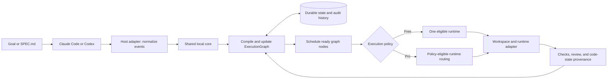
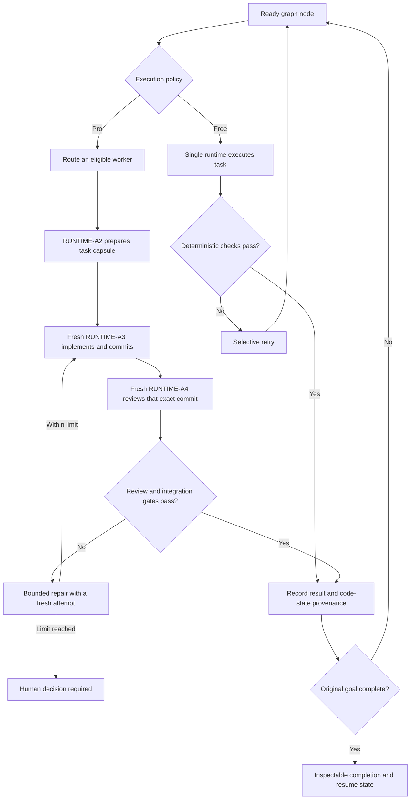

# Receipts

Receipts is designed as a host-neutral control plane for coding work. Its intended flow turns a developer goal into a durable `ExecutionGraph` that tracks work, results, reviews, and the exact code state each result applies to. Claude Code and Codex are the intended first-class hosts.

## How it is designed to work

The host is where a developer interacts with Receipts. A shared local core owns the graph and state, so the plan does not depend on one chat session or host. The execution policy decides how ready graph nodes are dispatched.



**One graph, two execution modes.** Free is designed for useful graph execution with one eligible runtime and deterministic checks. Pro is designed to add distributed roles, eligible-runtime routing, independent review, and bounded repair. A host used to view a goal need not be the runtime selected to execute a task. Provider participation always depends on the customer's permitted access and applicable policy.

### Execution and recovery

This simplified flow shows how work is intended to advance through the graph. In Pro, durable RUNTIME-A1 and RUNTIME-A2 roles coordinate workstreams; fresh RUNTIME-A3 and RUNTIME-A4 sessions implement and review. A failed check or review can create another attempt; accepted results are recorded against the code state that was actually checked.



The graph and its state are intended to survive interrupted sessions and allow continuation in either host. Review evidence is tied to an exact commit; a review of one commit does not approve a later change. Receipts can show which declared checks and reviews ran, but it cannot prove that code is correct.

**These diagrams describe the target product, not a currently working end-to-end flow.** See the [product definition](build-control/orchestrator-architecture/PRODUCT_DEFINITION.md), [MVP scope](build-control/orchestrator-architecture/MVP_SCOPE.md), and [implementation milestones](build-control/orchestrator-architecture/IMPLEMENTATION_MILESTONES.md).

## Project status

The repository contains Rust foundations for state, graph contracts, workspace execution, runtime adapters, routing, review, and host integration. The complete goal-to-graph-to-completion workflow and production-ready Free and Pro experiences are still in development. There is no supported install-and-run path for users yet.

Users bring their own permitted model/provider access. Receipts is intended to provide coordination software; it does not sell or proxy model credits.

## Repository map

| Path | Contents |
| --- | --- |
| `src/state/` | Durable state and entitlement foundations |
| `src/core/` | Graph, capsule, goal, and orchestration contracts |
| `src/workspace/`, `src/execution/`, `src/adapters/runtime/` | Workspace and runtime execution building blocks |
| `src/routing/`, `src/review/`, `src/hosts/` | Routing, review, and host integration building blocks |
| `crates/` | Rust workspace crates for subsystem boundaries and shared runtime bindings |
| `plugins/` | Claude Code and Codex plugin manifests |
| `build-control/orchestrator-architecture/` | Product architecture and contract documents |

`BUILD-A1/A2/A3/A4` in project documents name **implementation and review roles**. `RUNTIME-A1/A2/A3/A4` name **roles planned inside the product**. They are different systems.

## Development

The repository pins Rust **1.97.1** in `rust-toolchain.toml`. From the repository root, use the same checks as [repository CI](.github/workflows/ci.yml):

```sh
cargo fmt --all -- --check
cargo check --workspace --locked
cargo test --workspace --locked
cargo clippy --workspace --all-targets --all-features --locked -- -D warnings
```

There is currently no supported CLI, release package, or deployment procedure to run Receipts as a finished product. The [architecture documents](build-control/orchestrator-architecture/NEW_SYSTEM_ARCHITECTURE.md) describe the target system; they should not be treated as setup instructions.
